# 시퀀스 다이어그램 상세 설계

## 1. 사용자 시나리오별 시퀀스 다이어그램

### 1.1 초기 사용자 온보딩 플로우

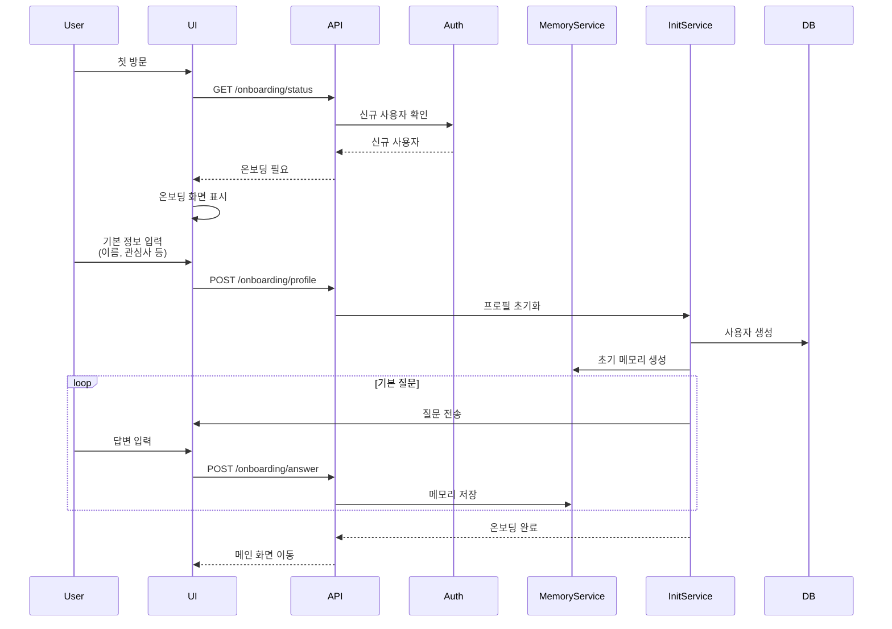

### 1.2 대화 중 동적 메모리 업데이트

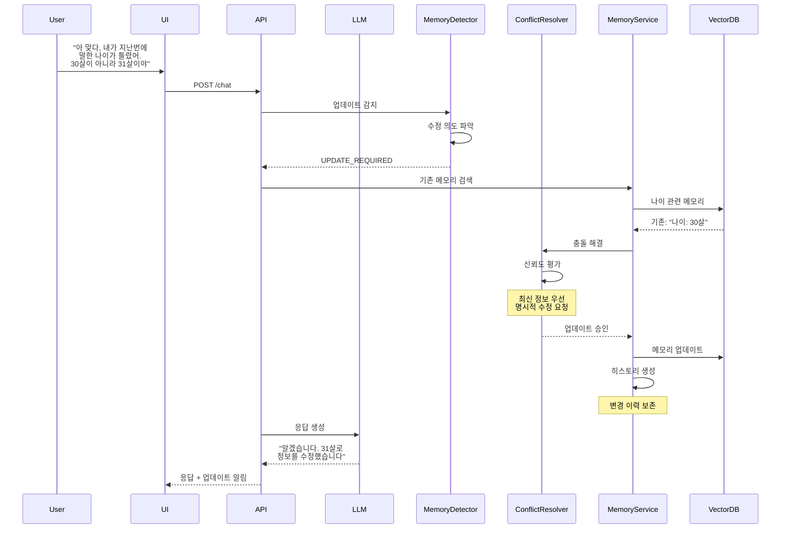

### 1.3 복잡한 메모리 연결 플로우

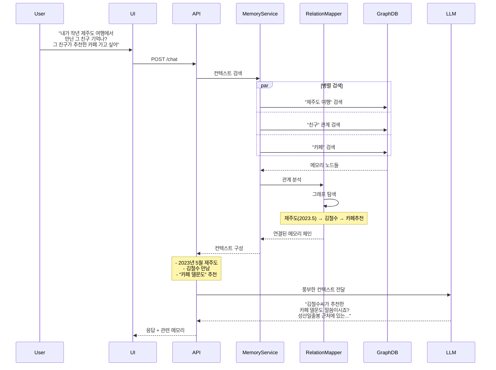

### 1.4 대량 메모리 임포트 처리

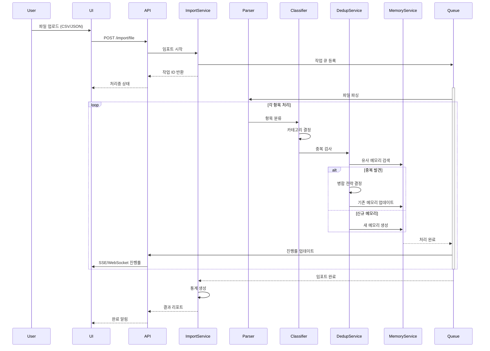

### 1.5 지능형 메모리 추천 시스템

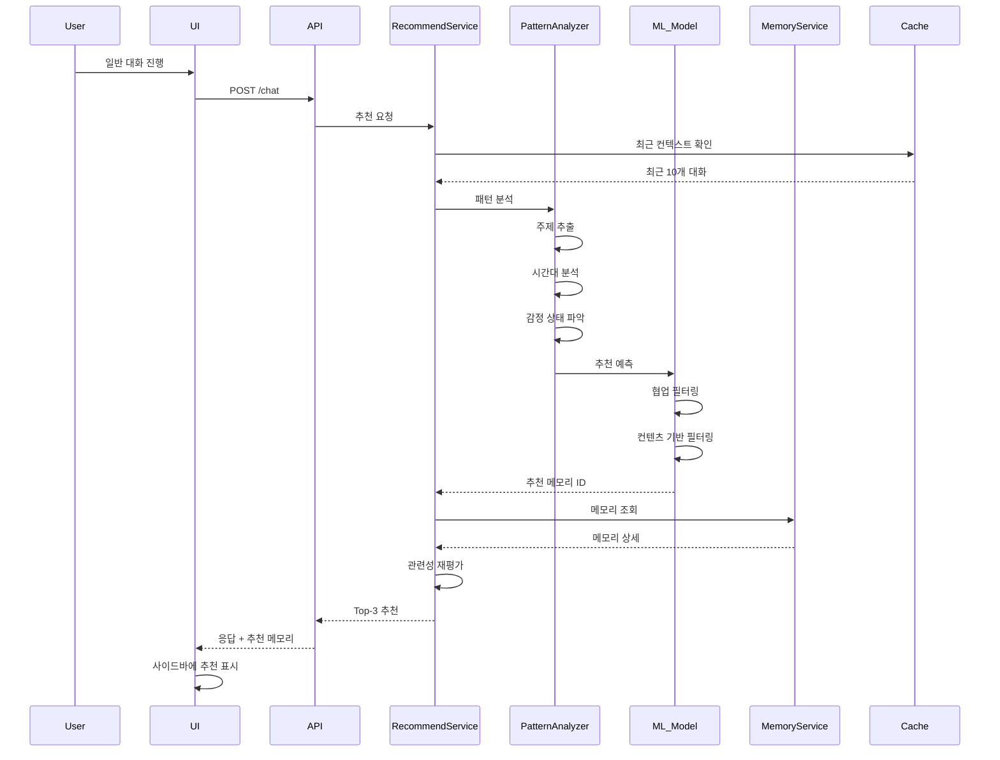

### 1.6 메모리 수명 주기 관리

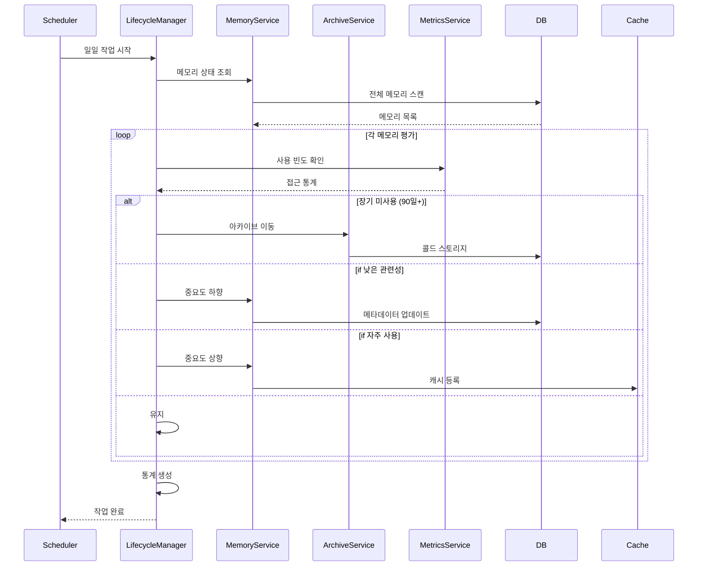

### 1.7 실시간 협업 메모리 동기화

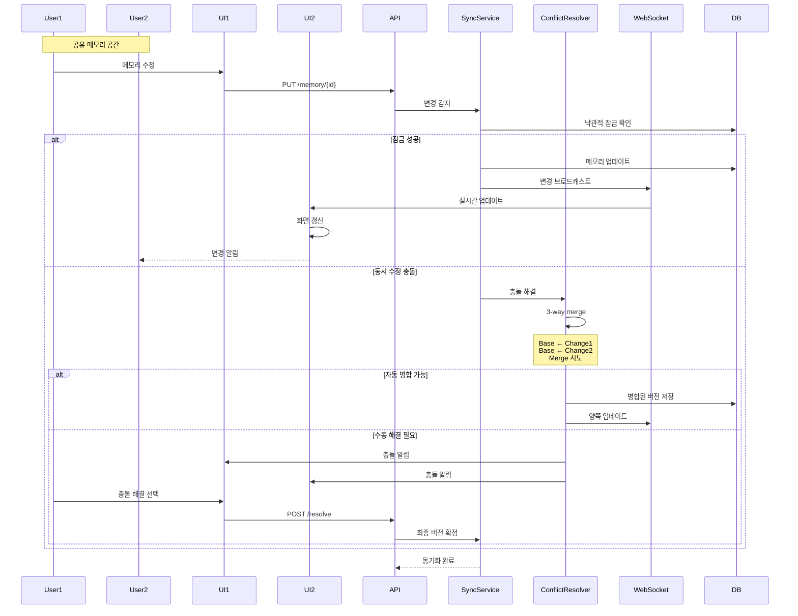

## 2. 에러 처리 시퀀스

### 2.1 메모리 저장 실패 복구

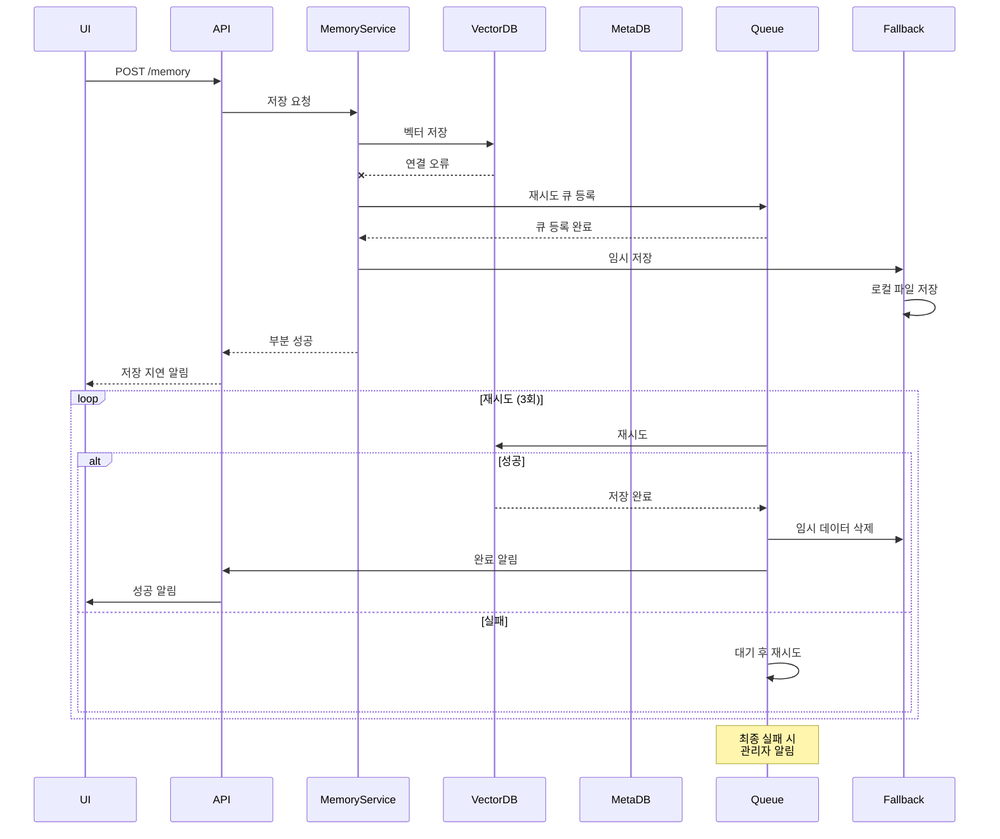

### 2.2 LLM 응답 실패 처리

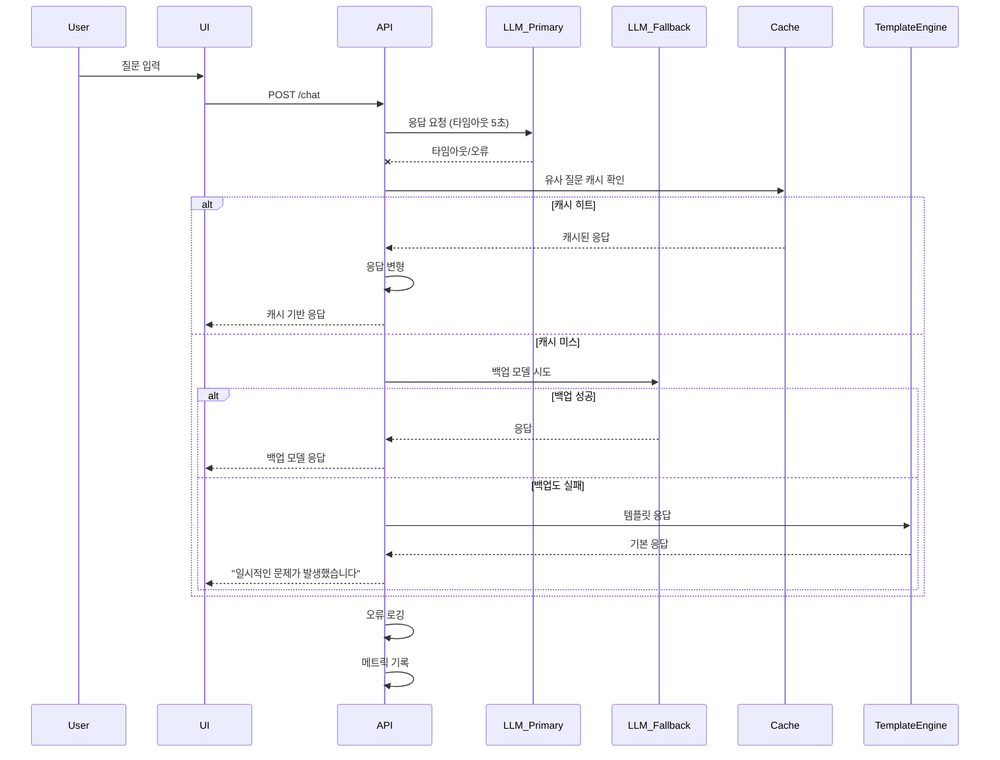

## 3. 성능 최적화 시퀀스

### 3.1 캐싱 전략 실행

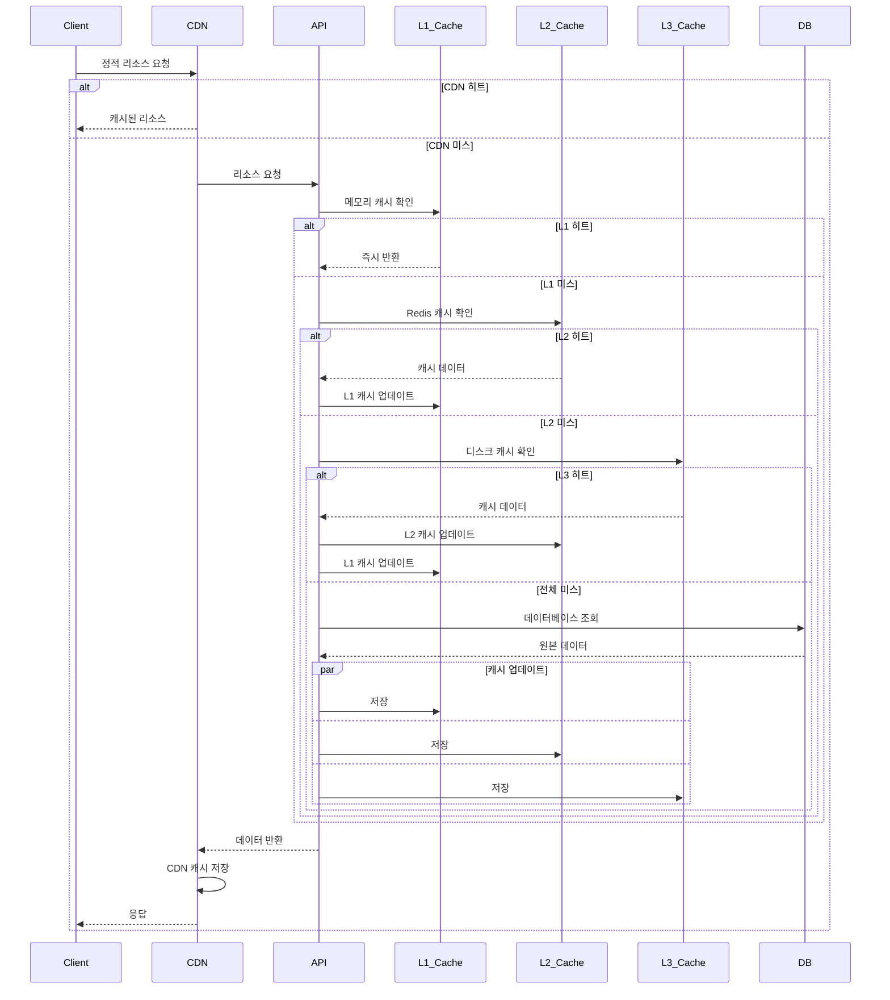

### 3.2 벡터 검색 최적화

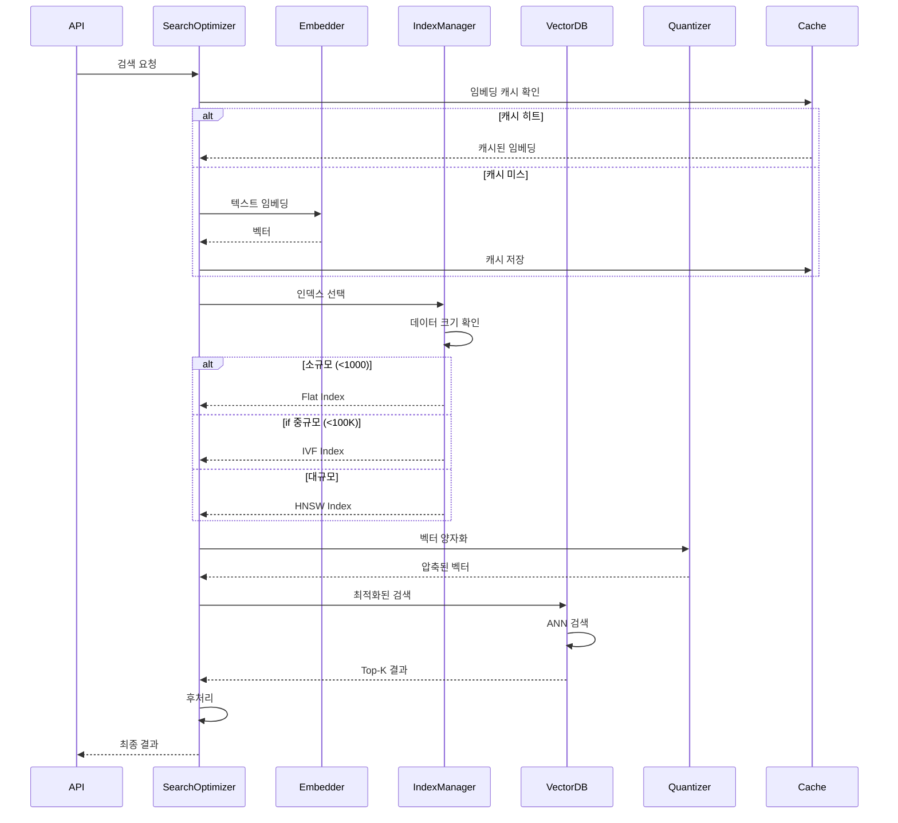

## 4. 보안 시퀀스

### 4.1 Zero-Trust 인증 플로우

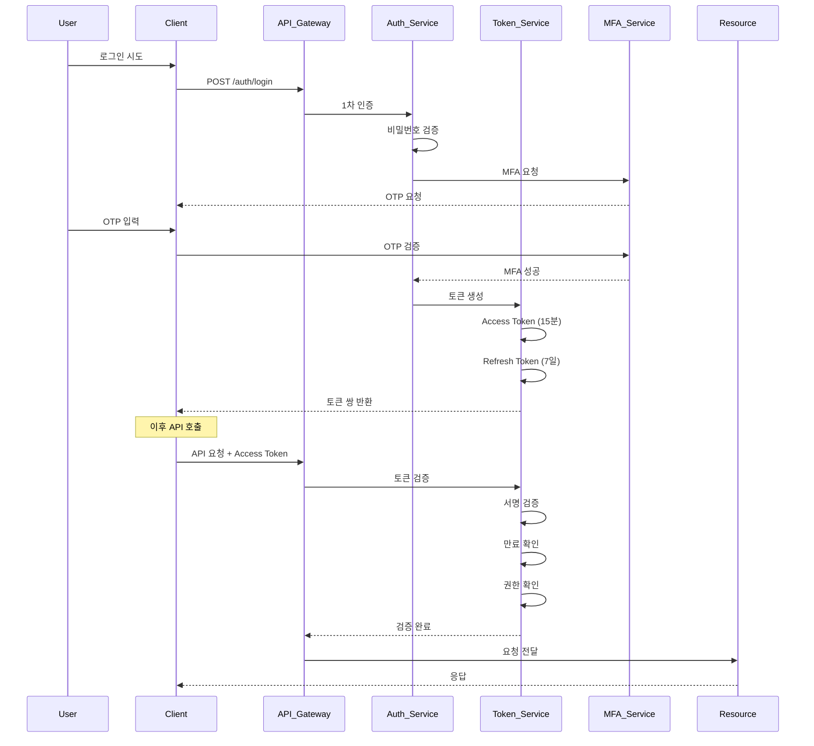

## 5. 모니터링 및 로깅 시퀀스

### 5.1 분산 추적 플로우

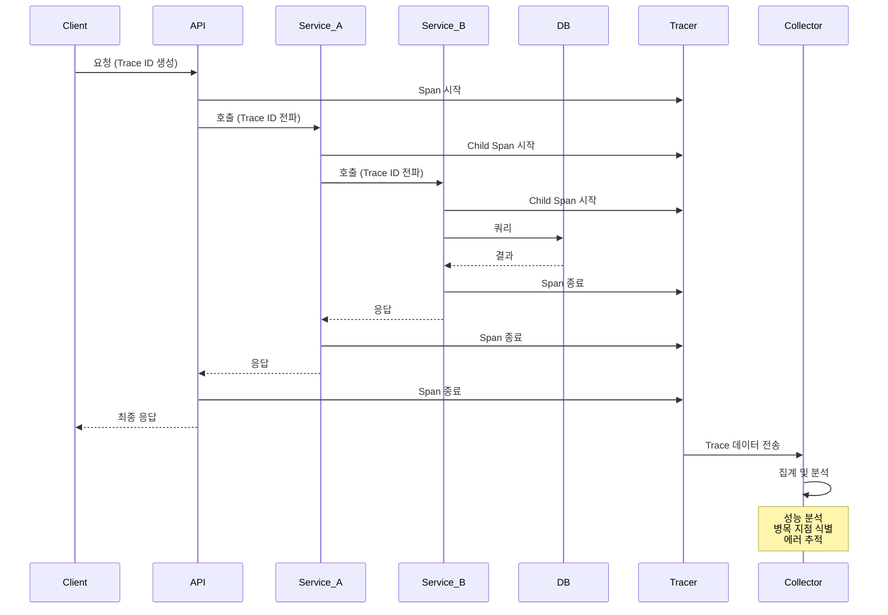

## 다음 단계

1. 구현 우선순위 결정
2. 프로토타입 개발 시작
3. 성능 테스트 시나리오 작성
4. 보안 감사 체크리스트 준비