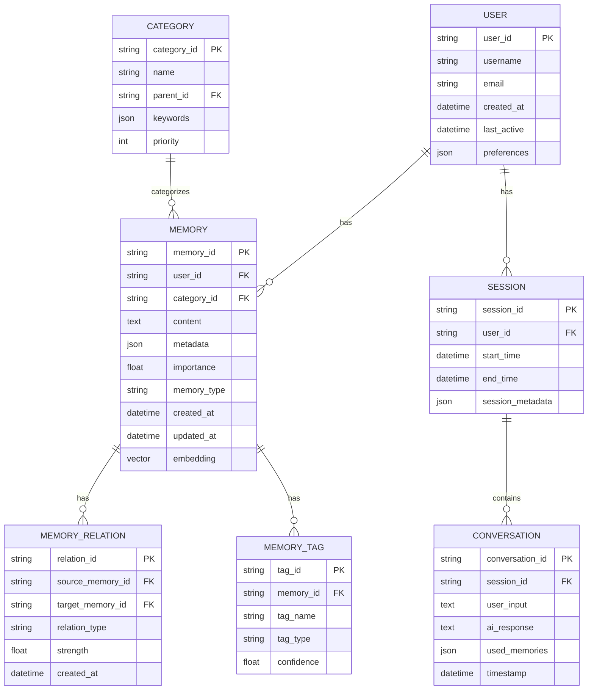

# 기술 아키텍처 설계 문서

## 1. 시스템 아키텍처 개요

### 1.1 전체 시스템 구성도


### 1.2 컴포넌트 계층 구조


## 2. 데이터 플로우 다이어그램

### 2.1 메모리 자동 저장 플로우


### 2.2 수동 메모리 입력 및 자동 분류 플로우


### 2.3 메모리 검색 및 활용 플로우


## 3. 메모리 처리 파이프라인

### 3.1 처리 단계별 플로우


### 3.2 메모리 관계 그래프


## 4. 데이터베이스 스키마

### 4.1 ERD (Entity Relationship Diagram)



## 5. API 엔드포인트 구조

### 5.1 RESTful API 설계

```mermaid
graph TD
    subgraph "Chat API"
        Chat[/api/chat]
        Chat --> POST_Chat[POST: 대화 처리]
        Chat --> GET_History[GET: 대화 기록]
    end

    subgraph "Memory API"
        Memory[/api/memory]
        Memory --> POST_Auto[POST: 자동 저장]
        Memory --> POST_Manual[POST: 수동 입력]
        Memory --> GET_Memory[GET: 조회]
        Memory --> PUT_Memory[PUT: 수정]
        Memory --> DELETE_Memory[DELETE: 삭제]
        Memory --> GET_Search[GET: 검색]
    end

    subgraph "Classification API"
        Class[/api/classify]
        Class --> POST_Classify[POST: 분류 요청]
        Class --> GET_Categories[GET: 카테고리 목록]
    end

    subgraph "User API"
        User[/api/user]
        User --> POST_Register[POST: 회원가입]
        User --> POST_Login[POST: 로그인]
        User --> GET_Profile[GET: 프로필]
        User --> PUT_Settings[PUT: 설정 변경]
    end

    subgraph "Export API"
        Export[/api/export]
        Export --> GET_JSON[GET: JSON 내보내기]
        Export --> GET_CSV[GET: CSV 내보내기]
        Export --> POST_Import[POST: 가져오기]
    end
```

## 6. 보안 및 인증 플로우


## 7. 성능 최적화 전략


## 8. 배포 아키텍처


## 9. 모니터링 및 로깅


## 다음 단계

1. 각 컴포넌트의 상세 인터페이스 정의
2. API 스펙 문서 작성 (OpenAPI)
3. 데이터베이스 마이그레이션 스크립트
4. 도커 컨테이너 설정
5. 개발 환경 구축 가이드